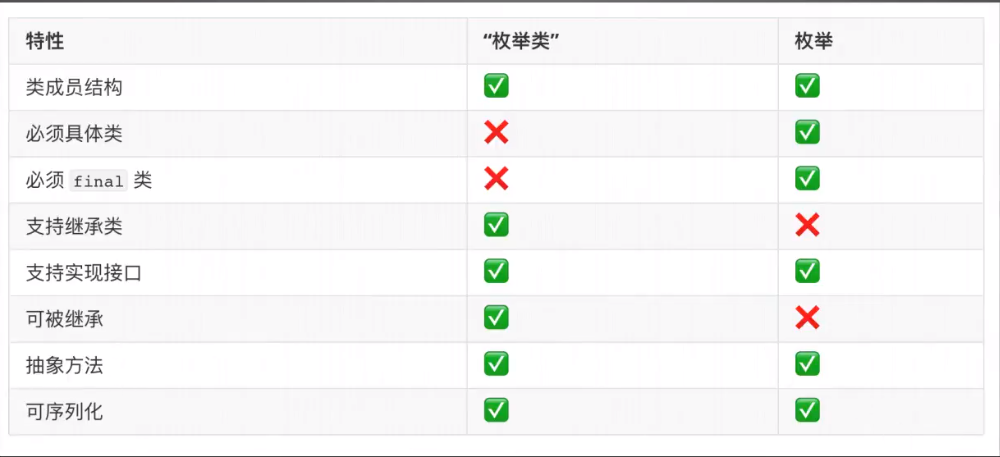

# Java 接口设计

### 通用设计 - 类/接口名

- 模式：（形容词）+ 名词
- 举例：
  - 单名词：java.lang.String
  - 双名词：java.util.ArrayList
  - 形容词+名词：java.util.LinledList

### 通用设计 - 可访问性

- public：开放API使用场景

  - 举例：java.lang.String

- （默认）：仅在当前`package`下使用

  - 举例：java.io.FileSystem

  #### 四种修饰符

- public

- (default)：仅在当前package下使用，属于私有API

- protected：不能用于修饰最外层class

- private：不能用于修饰最外层class

### 通用设计 - 可继承性

- final：final不具备继承性，仅用于实现类，不能与`abstract`关键字同时修饰
  - 举例：java.lang.String
- 非final：最常见/默认的设计手段，可继承性依赖于可访问性
  - 举例：java.io.FileSystem

### 具体类设计

- #### 常见场景

  - 功能组件
    - HashMap
  - 接口/抽象类实现
    - HashMap <- AbstractMap <- Map
  - 数据对象
    - POJO
  - 工具辅助
    - *Utils
    - ViewHelper
    - Helper

- #### 命名模式

  - 前缀：“Default“、"Generic"、"Common"、"Basic"
  - 后缀：“Impl”

### 抽象类设计

- #### 常见场景

  - 接口通用实现（模板模式）
    - Sping *Template
    - AbstractList
    - AbstractSet
    - AbstractMap
  - 状态/行为继承
  - 工具类

- #### 常见模式

  - 抽象程度介于类与接口之间（Java 8+ 可完全由接口代替）
  - 以 “Abstract” 或 “Base” 类名前缀
    - java.util.AbstractCollection
    - javax.sql.rowset.BaseRowSet

### 接口设计

- #### 常见场景

  - 上下游系统（组件）通讯契约
    - API
    - RPC
  - 常量定义

- #### 常见模式

  - 无状态（stateless）
  - 完全抽象（ < Java 8）
  - 局部抽象（ Java 8 +）
  - 单一抽象（ Java 8 函数式接口）
  
- #### 标记

  - Serializable
  - Cloneable
  - AutoCloseable
  - EventListener

### 内置类设计

- #### 常见场景

  - 临时数据存储类：java.lang.TreadLocal.ThreadLocalMap
  - 特殊用途的API实现：java.util.Collections.UnmodifiableCollection
  - Builder模式（接口）：java.util.stream.Stream.Builder

# Java 枚举设计

## 枚举类

- ### 场景：Java枚举（enum）引入之前的模拟枚举实现类

- ### 模式：

  - 成员用常量表示，并且类型为当前类型
  - 常用关键字 final 修饰类
  - 非 public 构造器

- ### 基本特性

  - 类结构（强类型）
  - 继承 java.lang.Enum
  - 不可显示地继承和被继承

— 枚举实际是final class 

—它的成员修饰符为 public static final

— `values()`是Java编译器做的字节码提升

### “枚举类” VS 枚举

第二条 可能为抽象类，不具体

#### 在修饰了`final`关键字的类中，唯独枚举类中可实现抽象方法

