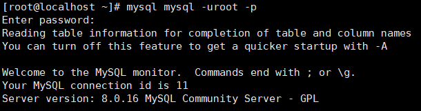

1. 数据量和底层B＋树的关系 ；

2. “丢脏重幻”四种事务等级底层原理MVCC;

3. 唯一索引和普通索引关键不同点: buffer区

4. MRR: multi range read

【优化总结口诀】
全值匹配我最爱，最左前缀要遵守；
带头大哥不能死，中间兄弟不能断；
索引列上少计算，范围之后全失效；
Like百分写最右，覆盖索引不写星；
不等空值还有or，索引失效要少用；
VAR引号不可丢，SQL高级也不难！

### 一、查找并卸载原有的mysql数据库

1.使用 rpm -qa | grep mysql 命令查找mysql数据库软件包及依赖包；

若没有任何显示则证明没有相关的mysql数据库；

若显示了相关的软件包及依赖包，使用 yum remove xxx 命令依次删除显示的包；注意：xxx为显示的软件包及依赖包包名；

2.使用 find / -name mysql 命令查找原有mysql数据库的相关配置文件；

可能显示如下：

/etc/selinux/targeted/active/modules/100/mysql

/usr/lib64/mysql

/usr/share/mysql

然后根据需求情况使用命令 rm -rf xxx 依次删除以上文件，例如：rm -rf /etc/selinux/targeted/active/modules/100/mysql；

### 二、查看mariadb的相关包并卸载

1.使用 rpm -qa | grep mariadb 命令查看；

显示为：mariadb-libs-5.5.56-2.el7.x86_64

2.使用 rpm -e --nodeps mariadb-libs-5.5.56-2.el7.x86_64 命令卸载；

3.使用 rm /etc/my.cnf 删除my.cnf文件（这个文件可能不存在，没关系的），防止对新安装的数据库有冲突，后面会再新建一个my.cnf文件；

### 三、安装mysql数据库

1.使用wget命令从官网下载最新版本（即8.0.16 64位），其余版本操作一样，需自行到官网下载；

命令为：wget https://cdn.mysql.com//Downloads/MySQL-8.0/mysql-8.0.16-linux-glibc2.12-x86_64.tar.xz

下载后文件为：mysql-8.0.16-linux-glibc2.12-x86_64.tar.xz

2.解压缩包,命令如下；

xz –d mysql-8.0.16-linux-glibc2.12-x86_64.tar.xz

tar -xvf mysql-8.0.16-linux-glibc2.12-x86_64.tar

3.给包重命名为mysql,并安装到/usr/local/目录下；

mv mysql-8.0.16-linux-glibc2.12-x86_64 /usr/local/mysql

4.检查mysql组和用户是否存在，如无创建，

cat /etc/group | grep mysql

cat /etc/passwd | grep mysql

创建mysql用户组

groupadd mysql

useradd -g mysql mysql

修改用户mysql的密码为mysql（自己设定）

passwd mysql

5.进入mysql目录并创建data目录；

cd /usr/local/mysql

mkdir data

6.赋权限给相关目录；

先返回上级目录，防止提示找不到对应目录

cd ..

chmod -R 777 /usr/local/mysql

chmod -R 777 /usr/local/mysql/data

7.将mysql目录的权限授给mysql用户和mysql组;

chown -R mysql:mysql /usr/local/mysql

8.新建mysql配置文件 my.cnf

vi /etc/my.cnf

配置文件内容为；

[mysql]

\# 设置mysql客户端默认字符集

default-character-set=utf8

[mysqld]

skip-name-resolve

\#设置3306端口

port = 3306

\# 设置mysql的安装目录

basedir=/usr/local/mysql

\# 设置mysql数据库的数据的存放目录

datadir=/usr/local/mysql/data

\# 允许最大连接数

max_connections=200

\# 服务端使用的字符集默认为8比特编码的latin1字符集

character-set-server=utf8

\# 创建新表时将使用的默认存储引擎

default-storage-engine=INNODB

lower_case_table_names=1

max_allowed_packet=16M

9.进入mysql 安装目录下：

 cd/usr/local/mysql/bin/

安装MySQL，并记住随机生成的密码，每次生成都不一样：

./mysqld --initialize --console

这里可能会出现如下错误（我在配置阿里云服务器时遇到的，原因可能是新的系统，没有安装所需的依赖）

解决办法就是根据提示安装所需依赖：这里我安装后就可以了，没有继续报错

10.修改config配置，修改SELINUX=disabled

vi /etc/selinux/config

11.创建软连接(实现可直接命令行执行mysql)

ln -s /usr/local/mysql/bin/mysql /usr/bin

12.mysqld配置,拷贝启动文件到/etc/init.d/下并重命名为mysqld

cp /usr/local/mysql/support-files/mysql.server  /etc/init.d/mysqld

增加执行权限

chmod 777 /etc/init.d/mysqld

检查自启动项列表中没有mysqld

chkconfig --list mysqld

如果没有就添加mysqld

chkconfig --add mysqld

设置开机启动

chkconfig mysqld on

启动测试

service mysqld start

上图说明我们成功安装mysql，这一步可能会报错，如下图：

> 错误解决排查思路：
> 1.可能是/usr/local/mysql/data/rekfan.pid文件没有写的权限
> 解决方法 ：给予权限，执行 “chown -R mysql:mysql /var/data” “chmod -R 755 /usr/local/mysql/data” 然后重新启动mysqld！

> 2.可能进程里已经存在mysql进程
> 解决方法：用命令“ps -ef|grep mysqld”查看是否有mysqld进程，如果有使用“kill -9 进程号”杀死，然后重新启动mysqld！

> 3.可能是第二次在机器上安装mysql，有残余数据影响了服务的启动。
> 解决方法：去mysql的数据目录/data看看，如果存在mysql-bin.index，就赶快把它删除掉吧，它就是罪魁祸首了。

> 4.mysql在启动时没有指定配置文件时会使用/etc/my.cnf配置文件，请打开这个文件查看在[mysqld]节下有没有指定数据目录(datadir)。
> 解决方法：请在[mysqld]下设置这一行：datadir = /usr/local/mysql/data

> 5.skip-federated字段问题
> 解决方法：检查一下/etc/my.cnf文件中有没有没被注释掉的skip-federated字段，如果有就立即注释掉吧。

> 6.错误日志目录不存在
> 解决方法：使用“chown” “chmod”命令赋予mysql所有者及权限

> 7.selinux惹的祸，如果是centos系统，默认会开启selinux
> 解决方法：关闭它，打开/etc/selinux/config，把SELINUX=enforcing改为SELINUX=disabled后存盘退出重启机器试试。

按顺序尝试

接着我们使用前面随机生成的密码登录mysql数据库，再重置密码；

mysql -u root -p（回车后输入前面的随机密码）

如上图，登录成功；

在mysql中修改密码为123456；

set PASSWORD = '123456';

### 四、开启mysql的远程访问权限

注意上面的‘123456’是重新设置后的密码；

退出mysql客户端

  mysql>exit

.重启mysql服务

  service mysqld restart

 

查看防火墙状态
  firewall-cmd --state
如果没有开启,则开启

开启防火墙: systemctl start firewalld.service

查看监听的端口: firewall-cmd --list-port

 添加3306端口监听

  firewall-cmd --zone=public --add-port=3306/tcp --permanent

刷新防火墙设置

  firewall-cmd --reload

到这里就全部完成了，可以在Windows连接Linux上的mysql数据库。